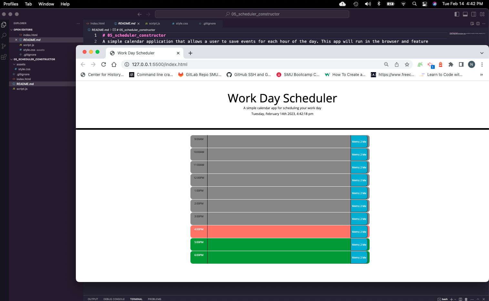

# 05_scheduler_constructor

## Description
A simple calendar application that allows a user to save events for each hour of the work day. If lunch is included, the hours for the scheduler is from 9:00AM - 6:00PM. This app will run in the browser and feature dynamically updated date and time within the HTML and CSS powered by jQuery.




## User Instructions
Open the app via the [Live URL link](https://nigelarue.github.io/05_scheduler_constructor/).
If a the hour is still available to input an event, users can input a description of the event. 
Available time slots are either 'red' or 'green'. If the slot is 'grey', users will not be able to input an event. To store and save the event, simply click the 'Memo 2 Me' 'blue' button.

To submit a ticket or download the code, please visit [the GitHub link](https://github.com/nigelarue/05_scheduler_constructor).

## Application Criteria
```md
GIVEN I am using a daily planner to create a schedule
WHEN I open the planner
THEN the current day is displayed at the top of the calendar
WHEN I scroll down
THEN I am presented with timeblocks for standard business hours
WHEN I view the timeblocks for that day
THEN each timeblock is color coded to indicate whether it is in the past, present, or future
WHEN I click into a timeblock
THEN I can enter an event
WHEN I click the save button for that timeblock
THEN the text for that event is saved in local storage
WHEN I refresh the page
THEN the saved events persist
```

## Contributing
Starter code provided by SMU Fullstack Bootcamp.